# Indoor-Fire-Monitoring-System

### Description

### What - The Problem 
Automated Temperature Control and Fire Detection is the Smart Home system that helps to control the temperature inside the home while at the same time helps to monitor for any fire. Temperature provides the comfort to the residents to stay cozy throughout the year whether during summer or winter. However, while providing comfort to the residents, providing safety is also crucial as fire accidents has been reported frequently throughtout the year across the country.

### Why - Who Cares? 
Keeping the temperature within the threshold can keep us to stay healthy and cozy as well as help to minimize the cost of electricity to control HVAC. Temperature and humidity sensors can be used for such purpose and it can also be used further to detect abnormal heat especially during the fire. Based on National Fire Prevention Association, in the five-year, US fire departments has responded to an estimated average of 354,400 home structure fires annually. However, fire can happen quite fast and these sensors can only detect when the fire spread to the point that it can sense. Due to that, camera, by using the power of image processing and deep learning, can detect the fire in its early stage and trigger the fire alarm to the resident before it spreads to the whole home area. Therefore, while we want to control the temprature and humidity to provide the comfort and cost saving to the users, we can go one step further to detect any fire that can happen within home to provide both safety and cost-saving.

### How - Actual Technical Approach

#### System Diagram
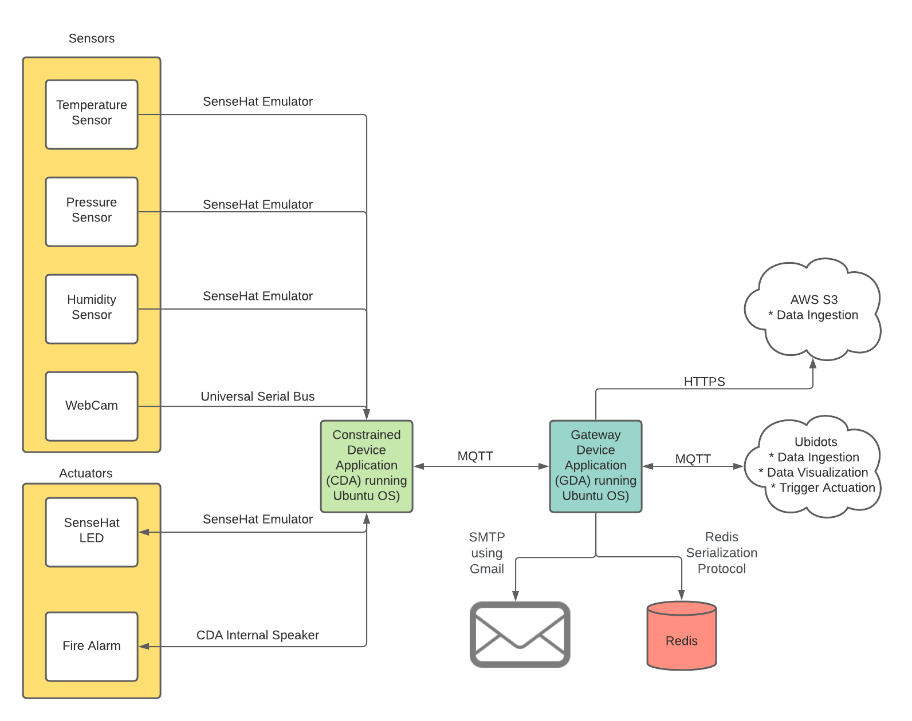

#### Sensors and Actuators
- CDA Sensor 1: Temperature
- CDA Sensor 2: Humidity
- CDA Sensor 3: Pressure
- CDA Sensor 4: WebCam
- CDA Actuator 1: SenseHat LED
- CDA ACtuator 2: Internal Speaker 

#### CDA protocol and GDA protocols
- CDA Protocol 1: MQTT

- GDA Protocol 1: MQTT
- GDA Protocol 2: HTTPS
- GDA Protocol 3: SMTP
 
#### What TWO (2) cloud services / capabilities did you use (add more if you wish)?
- Cloud Service 1 (ingress): Ubidots, Amazon AWS S3
- Cloud Service 2 (egress): Ubidots
 
### Results - Actual Outcomes and Visualization Screen Shot(s)

#### Outcomes Achieved

In this implemention, I managed to capture all the data from all 4 sensors. Images from WebCam are processed via OpenCV which are then applied to pretrained deep learning fire detection to provide the probability of fire likelihood which is then analyzed to whether play a fire alarm to alert the residents. CDA can also form a MQTT communication with GDA to send all of its sensor and system performance data to GDA which are then forwarded along with GDA internal performance data to the cloud services including AWS S3 and Ubidots. Within GDA, it stores CDA actuator command response, sensor (excluding image data) and system performance data and its internal performance on Redis database. GDA also analyze humidity data to determine if it is cross the ceiling and follor threshold which is then trigger an event send to CDA to turn on HVAC by displaying texts on SenseHat LED. GDA also form a communication with Ubidots via MQTT and with AWS S3 via HTTPS for ingesting all the CDA and GDA data. Ubidots also contain an event trigger that will send command to GDA and then to CDA to turn LED on SenseHat via MQTT. Besides, for CDA, once it has detected, it sent an actuator response to the GDA containing probability and image encode into Base 64 string to the GDA. Then, GDA check for that message and create an email using SMTP with TLS (GMAIL server) containg multi body part including text body part (alert about the fire and the probability of fire detected) and image body part (fire detected location), and sent to the resident. With all these successful communications, we can provide a comfort to the resident by adjusting temperature and humidity for the residents as well as alert them in the event of fire. 

#### Screen Shots Representing Visualized Data
##### Ubidot Dasboard
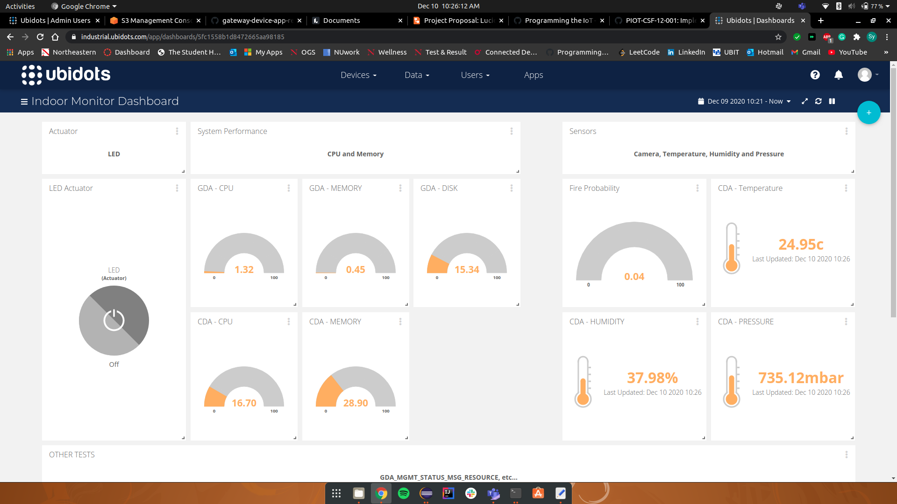
##### Amazon S3 Storage
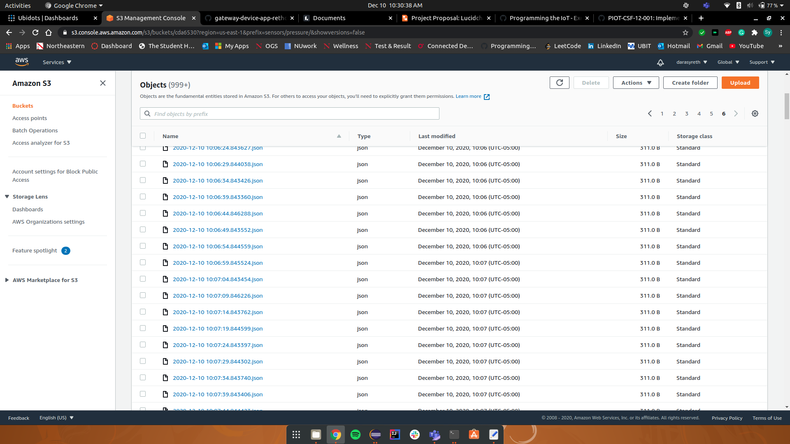
##### STMP Email Delivered
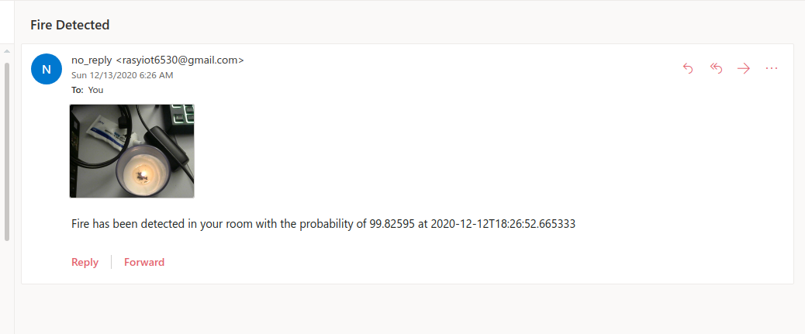

##### The following showing at least 2 hours of time-series data from the CDA:
##### CDA
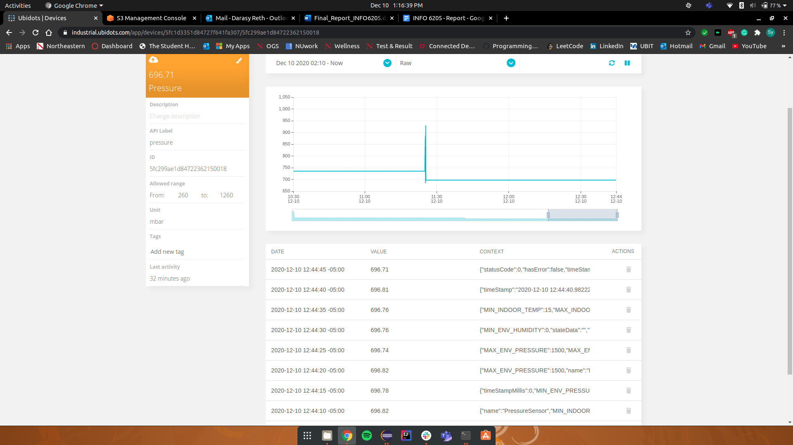

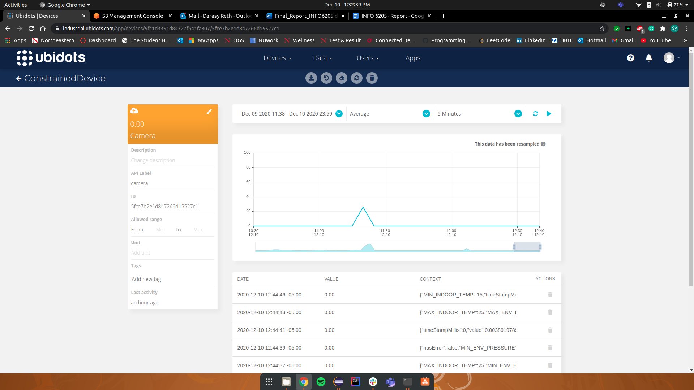

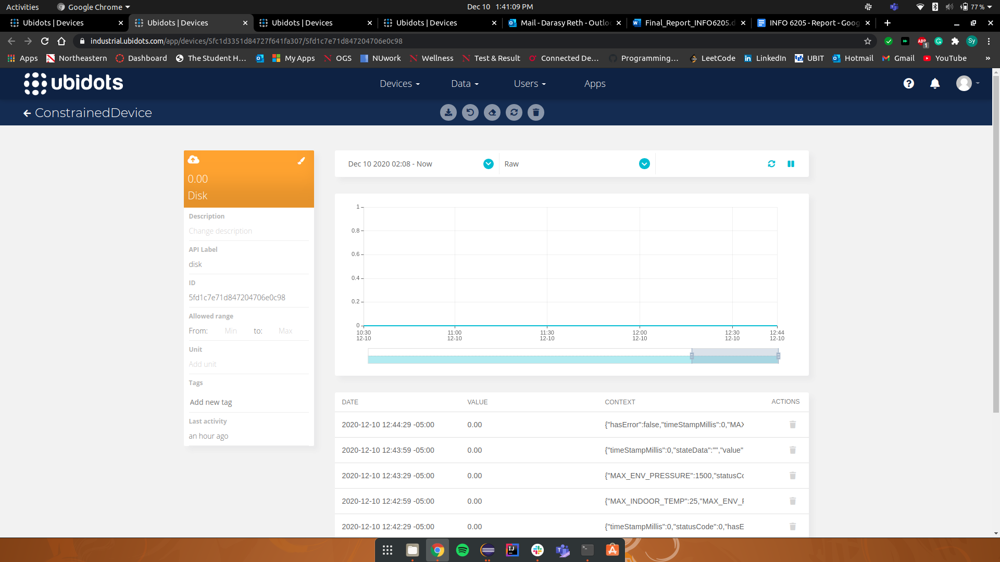
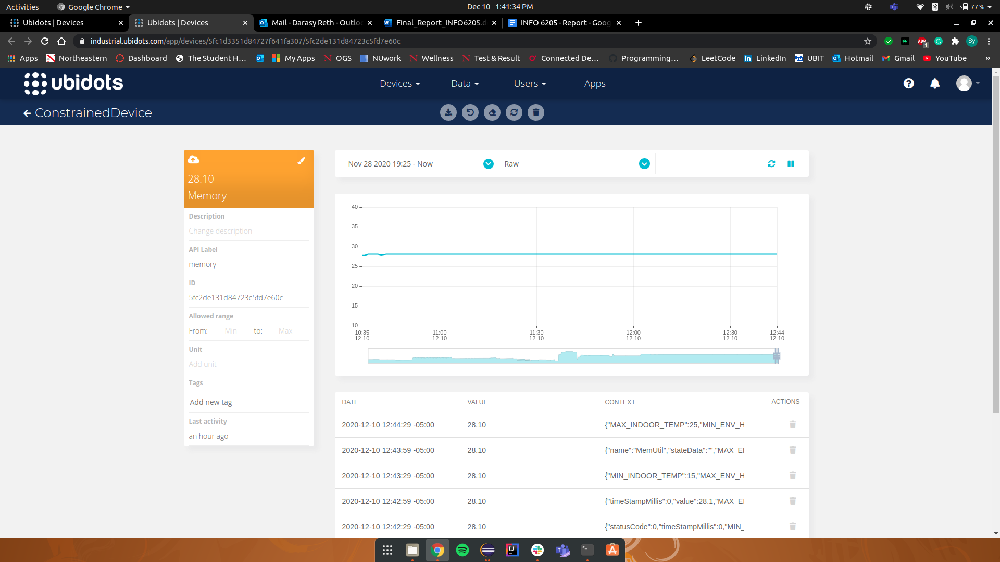
##### GDA

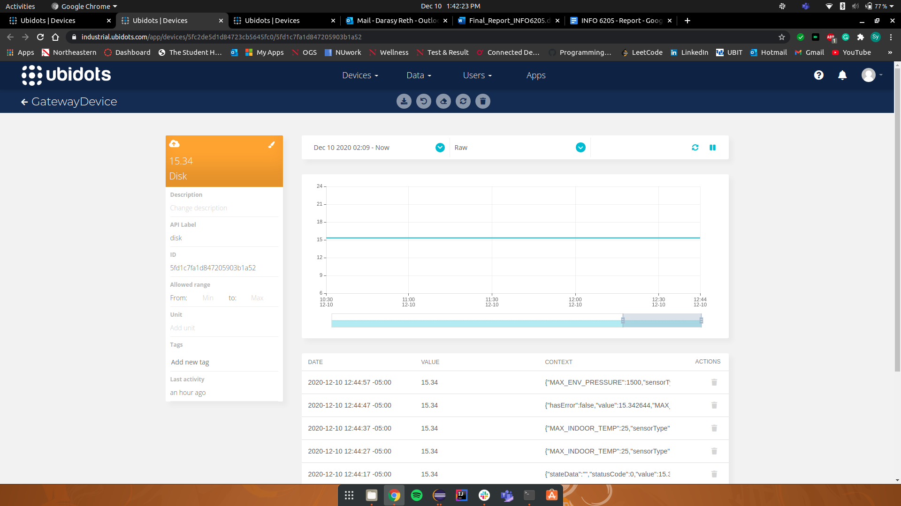
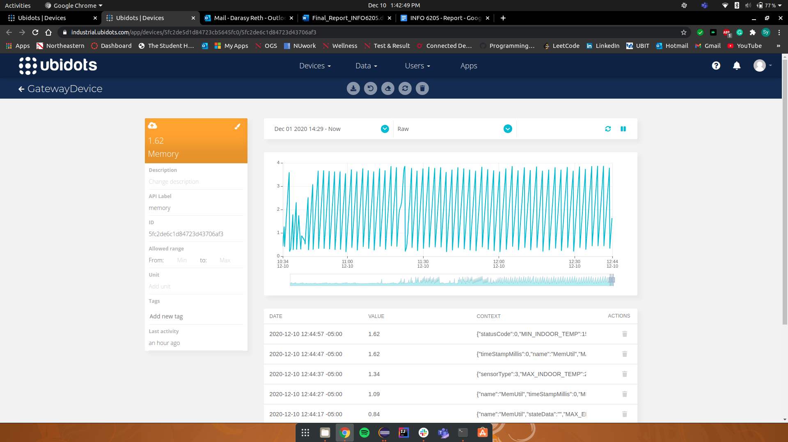

###### The following showing an event being triggered that results in an actuation event sent to GDA and then to CDA (picture in order):
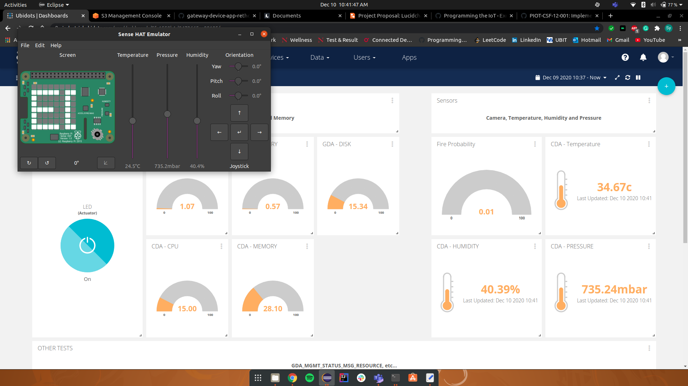
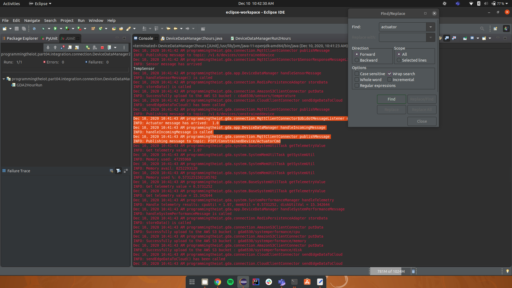
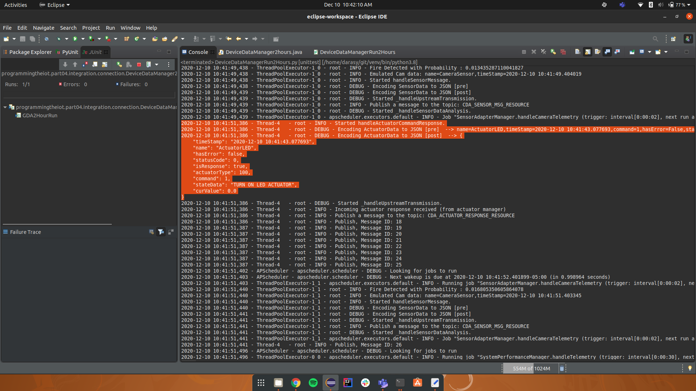

EOF.
